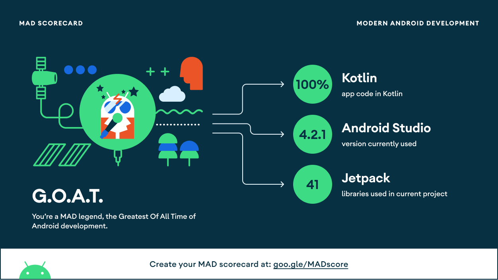

# Sample Android Automotive Wearable Monitoring

This is a sample application of how you can connect wearables to the Volvo Cars Infotainment system.
However, we at Volvo Cars are not medical device experts and do not intend to use this application
in production. It's just happening to be a Glucose Monitor Application that showcases as an example.
Read more about this at the [disclaimer](#disclaimer).

## Permissions

To get permissions to
show [heads-up notifications](https://developer.android.com/training/cars/notifications#hun), you
need to sign your app with the platform keys and set the notification channel importance level to at
least IMPORTANCE_HIGH.

Look in the [build.gradle](./automotive/build.gradle) to see how to sign your app with the
platform.keystore file.

This is a development key and not considered secret or sensitive.

## Project Structure

This project is following the clean architecture approach, by having an domain, data and
presentation layer.

### Core Layer

This layer handles all common used utilities within the app

### DI Layer

This layer handles the creation of dependencies within the app, such as databases, apis, use-cases
etc...

### Domain Layer

This layer handles the business logic of the app. It also connects the data layer with the
presentation.

### Data Layer

This layer is responsible for providing the data required by the application.

### Presentation Layer

This layer executes the UI logic for the application.

### Service Layer

This layer handles three things for now;

1. A ServiceStarter that is a BroadcastReceiver that listens on intent BOOT_COMPLETE, and when that
   is received it starts the WorkManager and also the NotificationService.
2. A GlucoseFetchWorker that is a Periodical Worker and will fetch new glucose values every 15
   minutes (minimum time for periodic workers).
3. A NotificationService that is responsible to show a notification with the latest fetched glucose
   values. And will also show a notification if the glucose values are going outside the threshold
   values. Both of those things require that the user have allowed notification in the
   PreferenceScreen. If no user is signed in, then a Notification will show that the user needs to
   configure the app (sign in).

## Dependency Info

1. If you want to use the Volvo UI Library for the application - reach out to
   developer.portal@volvocars.com for more information.

## MAD Scorecard

## License

Apache License 2.0

[Dependencies licenses information](/automotive/src/main/resources/aboutlibraries.json)

## Disclaimer

All information, thoughts, and code described here is intended for sample, informational and
educational purposes only. Use of code from this repository is without warranty or support of any
kind. Each element of the system can fail at any time rendering the system unusable. There is no
password protected privacy or security provided by these tools; all data you upload can be available
for anyone on the Internet to read if they have your specific URL to view your data. Please review
the LICENSE found within each repository for further details. This is not a project of the Volvo
Cars Corporation. Volvo Cars or Nightscout has no affiliation with Dexcom or any other company,
service or product mentioned anywhere on this website. Do not use any of this repository information
or code to make medical decisions - as this is purely a sample for connecting wearable to the car.

